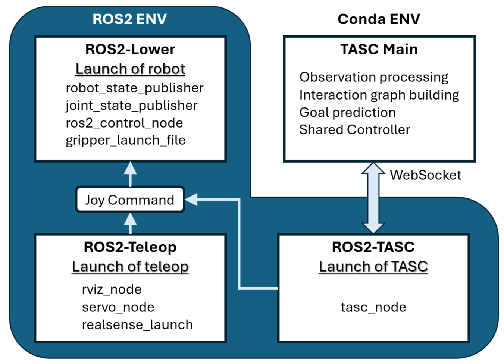

# TASC: Task-Aware Shared Control for Teleoperated Manipulation

This is the official implementation for the paper "TASC: Task-Aware Shared Control for Teleoperated Manipulation".

[[Paper]](https://arxiv.org/abs/2509.10416) | [[Website]](https://fitz0401.github.io/tasc-page/)

## Installation
### Install `tasc`
```bash
conda create -n tasc python=3.8
conda activate tasc
pip install -r requirements.txt
pip install -e .
```

### Install Other Dependencies
> **Note:** This installation is optional. We provide offline segmentation and grasp pose results for quick testing. Install this if you want to try the complete pipeline.


- `Grounded-SAM`

Clone the [Grounded-SAM](https://github.com/IDEA-Research/Grounded-Segment-Anything) repository, set some environment variables and install [GroundingDINO](https://github.com/IDEA-Research/GroundingDINO) and [SAM](https://arxiv.org/abs/2304.02643).
```bash
git clone git@github.com:IDEA-Research/Grounded-Segment-Anything.git
export AM_I_DOCKER=False
export BUILD_WITH_CUDA=True
export CUDA_HOME=/path/to/cuda/
python -m pip install -e segment_anything
pip install --no-build-isolation -e GroundingDINO
```

Download DINO and SAM checkpoints, in TASC root directory:
```bash
mkdir ckpts && cd ckpts
wget https://dl.fbaipublicfiles.com/segment_anything/sam_vit_h_4b8939.pth
wget https://github.com/IDEA-Research/GroundingDINO/releases/download/v0.1.0-alpha/groundingdino_swint_ogc.pth
```

- `AnyGrasp`

Check [anygrasp_sdk](https://github.com/graspnet/anygrasp_sdk) and follow the installation guide. 

1. Install [MinkowskiEngine](https://github.com/NVIDIA/MinkowskiEngine) manually following [the official instsallation instructions](https://github.com/NVIDIA/MinkowskiEngine?tab=readme-ov-file#cuda-11x).
    ```bash
    mkdir dependencies && cd dependencies
    conda install openblas-devel -c anaconda
    export CUDA_HOME=/usr/local/cuda-11.x
    git clone git@github.com:NVIDIA/MinkowskiEngine.git
    cd MinkowskiEngine
    python setup.py install --blas_include_dirs=${CONDA_PREFIX}/include --blas=openblas
    ```
    The following installation notes are adapted from [MBA](https://github.com/Selen-Suyue/MBA/blob/main/assets/docs/INSTALL.md) for compatibility reference:
    "For CUDA 12.1, the installation of MinkowskiEngine may be incompatible. You may need to add some headers in MinkowskiEngine. Refer to [issue#543](https://github.com/NVIDIA/MinkowskiEngine/issues/543).  
    In addition, for some necessary environment variable settings and to deal with module missing problems during the installation process, we recommend you to refer to the MinkowskiEngine section of this [blog](https://axi404.top/blog/anygrasp#minkowskiengine)."

2. Install other requirements from Pip.
    ```bash
    pip install -r requirements.txt
    ```

3. Install pointnet2 module.
    ```bash
    cd pointnet2
    python setup.py install
    ```

Then, follow the [license_registration](https://github.com/graspnet/anygrasp_sdk?tab=readme-ov-file#license-registration) to request an anygrasp_sdk license. 

Place the license, library and weight files under `tasc/vision_module`:

```
tasc/vision_module
    ├── gsnet.so
    ├── lib_cxx.so  # Make sure the *.so file is compatible with Python 3.8
    ├── license     # Your requested license file here
    ├── log
         └── checkpoint_detection.tar    # Weights here
```

> **Notes**: To avoid the license request process, you can modify the AnyGrasp-related code in `tasc/vision_module/object_detector.py`, specifically the `ObjectDetector.update_grasp_poses()`, to use [GraspNet Baseline](https://github.com/graspnet/graspnet-baseline) or other grasping models of your choice.

## Usage

Run TASC with stored query results:
```bash
python tasc/tasc_simulation.py 
```
Franka Panda Teleoperation with keyboard:

```
Keys                            Command
Ctrl+q                          reset simulation
spacebar                        toggle gripper (open/close)
up-right-down-left              move horizontally in x-y plane
.-;                             move vertically
o-p                             rotate (yaw)
y-h                             rotate (pitch)
e-r                             rotate (roll)
```

Other arguments:
```bash
# Run TASC with debug information
python tasc/tasc_simulation.py --debug

# Run TASC with online query
python tasc/tasc_simulation.py --llm

# Run in pure teleoperation mode (for comparison)
python tasc/tasc_simulation.py --pure_teleop

# Record operation data
python tasc/tasc_simulation.py --record
```

Analyse operation data:
```bash
python tasc/result_analyzer.py --input tasc --episode_idx 1 --task_idx 1
```

## Running on a Headless Server
If you need to run TASC on a headless server (no monitor attached) and display the GUI on your local machine, you can use X11 forwarding.

### On Windows
1. Install [XLaunch](https://sourceforge.net/projects/vcxsrv/) or [Xming](https://sourceforge.net/projects/xming/).
2. Start XLaunch (keep default settings).
3. In PowerShell, set the display environment variable:
```powershell
$env:DISPLAY="localhost:0.0"
```
4. Connect to the server with X11 forwarding enabled:
```powershell
ssh -Y <user>@<server-ip>
```

### On Linux/macOS
1. Make sure you have an X server installed locally (Linux usually has it by default; macOS can use [XQuartz](https://www.xquartz.org/)).
2. Connect to the server with X11 forwarding:
```bash
ssh -Y <user>@<server-ip>
```

## Real World

See our real-world setup in this [repo](https://github.com/fitz0401/tasc_ros2_ws).



In shrot, we use [moveit_servo](https://moveit.picknik.ai/main/doc/how_to_guides/controller_teleoperation/controller_teleoperation.html) to teleoperate a [Franka Research3 robot in ROS2](https://github.com/frankarobotics/franka_ros2) environment. We also seperate the ROS2 and CUDA environment and use websocket to communicate, to aviod python version conflict.


## Acknowledgements
We gratefully acknowledge the following open-source projects that greatly facilitated our work:

- Segmentation pipeline adapted from [MOKA](https://github.com/moka-manipulation/moka/tree/main).
- Goal prediction adapted from [Improved APF](https://github.com/Shared-control/improved-apf).

We also thank the [robosuite](https://github.com/ARISE-Initiative/robosuite) community for providing an excellent simulation framework that supported our research.

## Citing
If you find our paper interesting or useful in your work, please cite our paper:
```
@misc{fu2025tasc,
      title={TASC: Task-Aware Shared Control for Teleoperated Manipulation}, 
      author={Ze Fu and Pinhao Song and Yutong Hu and Renaud Detry},
      year={2025},
      eprint={2509.10416},
      archivePrefix={arXiv},
      primaryClass={cs.RO},
      url={https://arxiv.org/abs/2509.10416}, 
}
```


